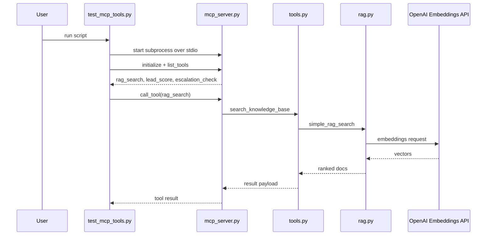
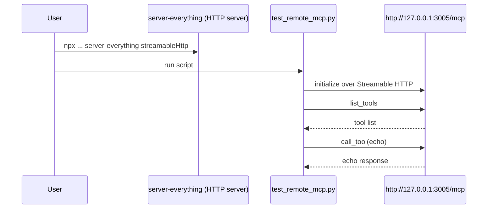

# Chapter 05 - Real MCP End-to-End (Local + Remote)

## Goal

This chapter teaches real MCP in two complete tutorials:
- Local MCP server + local MCP client over `stdio`
- Remote open-source MCP server over Streamable HTTP

No manual function wiring in the client and no fallback RAG path in this chapter.

## What "Real MCP" Means Here

- Server is a separate process exposing tools via MCP.
- Client connects via MCP transport (`stdio` or HTTP), initializes a session, discovers tools, and calls them by name.
- Business logic runs in server tools, not directly in the client.

## Files In This Chapter

- `agentdesk_ai/mcp_server.py`: MCP server and tool registration.
- `agentdesk_ai/tools.py`: Tool business logic wrappers.
- `agentdesk_ai/rag.py`: OpenAI embedding-only semantic search (no fallback).
- `scripts/test_mcp_tools.py`: Local MCP client test over `stdio`.
- `scripts/run_mcp_server.py`: Local server-only launcher.
- `scripts/test_remote_mcp.py`: Remote MCP client test over HTTP.

## One-Time Setup

From repository root:

```bash
pip install -r requirements.txt
```

Create `.env` in repository root:

```bash
OPENAI_API_KEY=your_openai_api_key
EMBEDDING_MODEL=text-embedding-3-small
```

Important:
- `OPENAI_API_KEY` is required now for local RAG tool calls.
- If key is invalid/missing, local `rag_search` fails by design.

## Tutorial 1: Local Real MCP (`stdio`)

Run from `chapter_05_mcp_tool_server`:

```bash
python scripts/test_mcp_tools.py
```

### What happens step-by-step

1. Client script starts server subprocess: `python -m agentdesk_ai.mcp_server`.
2. Client opens MCP `stdio` streams to that process.
3. Client sends `initialize`.
4. Client calls `list_tools`.
5. Client calls:
   - `rag_search(customer_message)`
   - `lead_score(customer_message)`
   - `escalation_check(customer_message, lead_score_value)`
6. Server executes tool functions and returns MCP tool responses.
7. Client prints results.

### Expected local behavior

- Tool discovery prints: `rag_search`, `lead_score`, `escalation_check`.
- `rag_search` uses OpenAI embeddings only.
- No keyword fallback is used.

## Tutorial 2: Remote Open-Source MCP (HTTP)

This tutorial uses the official open-source reference server package:
- `@modelcontextprotocol/server-everything`

### Step 1: Start a remote MCP server over HTTP

In a new terminal:

```bash
$env:PORT=3005
npx -y @modelcontextprotocol/server-everything streamableHttp
```

This starts a network-accessible MCP endpoint at:
- `http://127.0.0.1:3005/mcp`

### Step 2: Connect with the chapter's remote client

From `chapter_05_mcp_tool_server`:

```bash
python scripts/test_remote_mcp.py
```

Optional custom URL:

```bash
python scripts/test_remote_mcp.py http://127.0.0.1:3005/mcp
```

### What happens step-by-step

1. Open-source MCP server runs as an HTTP service.
2. Client opens Streamable HTTP transport to `http://127.0.0.1:3005/mcp`.
3. Client initializes MCP session.
4. Client calls `list_tools`.
5. If `echo` exists, client calls `echo` and prints response.

### Optional public remote reference server

You can also try:
- `https://example-server.modelcontextprotocol.io/mcp`

Some environments may require authentication and return `401 Unauthorized`. That is why this chapter's default remote tutorial uses `server-everything` locally for reliability.

### Why this is useful for teaching

- Shows real remote MCP over network transport.
- Uses free open-source server implementation.
- Demonstrates that local and remote MCP client logic is almost identical.
- Helps explain transport differences: local `stdio` vs remote HTTP.

## What happens step-by-step (remote MCP client internals)

1. Client builds Streamable HTTP transport.
2. Client initializes MCP session.
3. Client calls `list_tools`.
4. Client invokes `echo` tool when available.

## Optional: Run Local Server Manually

From `chapter_05_mcp_tool_server`:

```bash
python scripts/run_mcp_server.py
```

This starts the local MCP server and waits for MCP messages. Use this when demonstrating server lifecycle separately.

## Sequence Diagrams

### Local MCP Flow



### Remote MCP Flow



## Troubleshooting

### `ModuleNotFoundError: No module named 'mcp'`

Install dependencies:

```bash
pip install -r requirements.txt
```

### Local `rag_search` fails with auth error

- Verify `.env` has a valid `OPENAI_API_KEY`.
- Re-open terminal/session after updating env if needed.

### Remote script fails to connect

- Check network/proxy/firewall rules.
- Confirm `server-everything` is running on port `3005`.
- Confirm the URL used by client matches the server URL.

## Real MCP Checklist

- Client does not import and call `tools.py` directly.
- Client uses `ClientSession`.
- Client discovers tools with `list_tools`.
- Client invokes tools with `call_tool`.
- Server is transport-connected (`stdio` local or HTTP remote).
